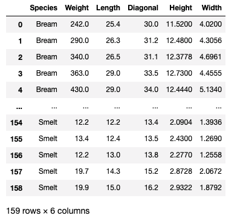

# 로지스틱 회귀분석

 - 종속변수(y)가 Binary한 범주형 자료일 때 로지스틱 회귀분석을 활용한 Y 예측 모델을 만들 수 있음

   

## 1. 원리


 - Linear Regression 에서는 Y 자체를 ax+b로 모델링.

 - Logistic Regression 에서는 Y가 성공할 확률을 P(Y=1)=ax+b 로 모델링. 

 - Y가 성공할 확률이 0.5 이상일 시 성공, 미만일 시 실패로 분류

   

## 2. 문제점

### z = ax+b


​    

​    


 - 확률의 범위는 0~1 이여야 함
 - z가 클 수록 1에 가까워지고 z가 작을 수록 0에 가까워지게 만들어야함
 - 따라서 시그모이드 함수와 같은 활성함수를 사용하여 조정
 - z = ax+b 일 경우
 - Y = s(z) = 1/(1+e^(-z)) = 1/(1+e^(-(ax+b)))


    

## 3. 이진분류 수행하기


### 데이터 준비하기

- 물고기 데이터


```python
import pandas as pd
fish = pd.read_csv('https://bit.ly/fish_csv_data')
```


```python
pd.unique(fish['Species'])
```


    array(['Bream', 'Roach', 'Whitefish', 'Parkki', 'Perch', 'Pike', 'Smelt'],
          dtype=object)


```python
fish
```



### input data 생성하기

 - Weight, Length, Diagonal, Height, Width 컬럼 들어감


```python
fish_input = fish[['Weight','Length','Diagonal','Height','Width']].to_numpy()
```


```python
fish_input[:10]
```


    array([[242.    ,  25.4   ,  30.    ,  11.52  ,   4.02  ],
           [290.    ,  26.3   ,  31.2   ,  12.48  ,   4.3056],
           [340.    ,  26.5   ,  31.1   ,  12.3778,   4.6961],
           [363.    ,  29.    ,  33.5   ,  12.73  ,   4.4555],
           [430.    ,  29.    ,  34.    ,  12.444 ,   5.134 ],
           [450.    ,  29.7   ,  34.7   ,  13.6024,   4.9274],
           [500.    ,  29.7   ,  34.5   ,  14.1795,   5.2785],
           [390.    ,  30.    ,  35.    ,  12.67  ,   4.69  ],
           [450.    ,  30.    ,  35.1   ,  14.0049,   4.8438],
           [500.    ,  30.7   ,  36.2   ,  14.2266,   4.9594]])


### target data 생성하기

 - 분류 대상(종속변수)인 species 컬럼 해당


```python
fish_target = fish['Species'].to_numpy()
```


```python
fish_target[:len(fish_target)//2]
```


    array(['Bream', 'Bream', 'Bream', 'Bream', 'Bream', 'Bream', 'Bream',
           'Bream', 'Bream', 'Bream', 'Bream', 'Bream', 'Bream', 'Bream',
           'Bream', 'Bream', 'Bream', 'Bream', 'Bream', 'Bream', 'Bream',
           'Bream', 'Bream', 'Bream', 'Bream', 'Bream', 'Bream', 'Bream',
           'Bream', 'Bream', 'Bream', 'Bream', 'Bream', 'Bream', 'Bream',
           'Roach', 'Roach', 'Roach', 'Roach', 'Roach', 'Roach', 'Roach',
           'Roach', 'Roach', 'Roach', 'Roach', 'Roach', 'Roach', 'Roach',
           'Roach', 'Roach', 'Roach', 'Roach', 'Roach', 'Roach', 'Whitefish',
           'Whitefish', 'Whitefish', 'Whitefish', 'Whitefish', 'Whitefish',
           'Parkki', 'Parkki', 'Parkki', 'Parkki', 'Parkki', 'Parkki',
           'Parkki', 'Parkki', 'Parkki', 'Parkki', 'Parkki', 'Perch', 'Perch',
           'Perch', 'Perch', 'Perch', 'Perch', 'Perch'], dtype=object)


### 훈련 세트와 테스트 세트로 나누기

 - 일단 이진분류이므로 bream과 Smelt만 분류해보기
 - input, target 데이터에서 Bream과 Smelt의 행만 골라내기


```python
bream_smelt_indexes = (fish_target == "Bream") | (fish_target == "Smelt")
```


```python
b_s_input = fish_input[bream_smelt_indexes]
b_s_target = fish_target[bream_smelt_indexes]
```


 - b_s_input -> train_input(학습 시 입력데이터), test_input(테스트 시 입력데이터)
 - b_s_target -> train_target(학습 시 입력데이터), test_target(테스트 시 타겟데이터)
 - sklearn의 train_test_split 함수가 알아서 만들어 줌
 - 기본적으로 25%정도 테스트세트로 떼어 냄


```python
from sklearn.model_selection import train_test_split
```


```python
train_input, test_input, train_target, test_target = train_test_split(b_s_input, b_s_target, stratify = b_s_target, random_state=42)
```

### input data 표준화 전처리

 - sklearn의 StandardScaler 활용


```python
from sklearn.preprocessing import StandardScaler
```


```python
ss = StandardScaler()
ss.fit(train_input)

train_scaled = ss.transform(train_input)
test_scaled = ss.transform(test_input)
```


```python
train_scaled[:10]
```


    array([[ 0.85382543,  0.79935928,  0.80567236,  0.8021994 ,  0.94206579],
           [-0.24256812,  0.20479453,  0.20860116,  0.20215901,  0.09992817],
           [-1.33066961, -1.54917151, -1.54897461, -1.57423679, -1.53349422],
           [ 0.17817675,  0.37325454,  0.43565641,  0.44942495,  0.35955077],
           [-1.32729137, -1.55908092, -1.56579351, -1.55688885, -1.53761603],
           [ 1.46805151,  1.14618873,  1.10000323,  1.07895683,  1.05350927],
           [-1.32698425, -1.49962444, -1.50692734, -1.5352948 , -1.59496073],
           [ 0.48528979,  0.50207691,  0.51975094,  0.64957059,  0.6793003 ],
           [-1.32729137, -1.47980562, -1.49851789, -1.53686438, -1.6039772 ],
           [ 0.83539865,  0.89845341,  0.88135744,  0.8278413 ,  0.81918428]])


```python
test_scaled[:10]
```


    array([[ 0.86918109,  0.79935928,  0.83090072,  0.80190201,  0.92310545],
           [ 0.54671239,  0.74981222,  0.72998728,  0.66356459,  0.52478389],
           [ 1.56018542,  1.39392404,  1.30183011,  1.01065553,  1.0865868 ],
           [-1.29627295, -1.18252324, -1.24623428, -1.41661838, -1.22744971],
           [-1.31992065, -1.38071149, -1.44806117, -1.52486952, -1.54864188],
           [ 0.51600109,  0.6507181 ,  0.63748329,  0.68178819,  0.44940626],
           [-1.32667714, -1.49962444, -1.50692734, -1.5352948 , -1.53421554],
           [ 0.40851153,  0.70026516,  0.71316837,  0.59843548,  0.67389042],
           [-1.33589053, -1.61853739, -1.63306914, -1.61550836, -1.6039772 ],
           [ 1.25307238,  0.89845341,  0.88976689,  0.8894017 ,  0.99791633]])


### 로지스틱 회귀모델 훈련

```python
from sklearn.linear_model import LogisticRegression
```

```python
lr = LogisticRegression()
lr.fit(train_scaled, train_target)
```


```python
print(lr.predict(test_scaled))
```

    ['Bream' 'Bream' 'Bream' 'Smelt' 'Smelt' 'Bream' 'Smelt' 'Bream' 'Smelt'
     'Bream' 'Bream' 'Bream' 'Bream']


```python
print(lr.predict_proba(test_scaled))
```

    [[9.97328384e-01 2.67161624e-03]
     [9.94425341e-01 5.57465921e-03]
     [9.99430626e-01 5.69374399e-04]
     [1.02252107e-01 8.97747893e-01]
     [5.42567620e-02 9.45743238e-01]
     [9.93090433e-01 6.90956710e-03]
     [4.73590326e-02 9.52640967e-01]
     [9.94050407e-01 5.94959254e-03]
     [3.45964080e-02 9.65403592e-01]
     [9.98334761e-01 1.66523949e-03]
     [9.69791912e-01 3.02080875e-02]
     [9.90586211e-01 9.41378935e-03]
     [9.82955642e-01 1.70443576e-02]]


 - predict_proba -> 예측 확률 반환
 - 이진 분류의 경우에서는 샘플마다 음성클래스와 양성 클래스에 대한 확률 반환


```python
proba = lr.predict_proba(test_scaled)
```


```python
np.round(proba,decimals=3)
```


    array([[0.997, 0.003],
           [0.994, 0.006],
           [0.999, 0.001],
           [0.102, 0.898],
           [0.054, 0.946],
           [0.993, 0.007],
           [0.047, 0.953],
           [0.994, 0.006],
           [0.035, 0.965],
           [0.998, 0.002],
           [0.97 , 0.03 ],
           [0.991, 0.009],
           [0.983, 0.017]])


### 학습계수 확인


```python
print(lr.coef_, lr.intercept_)
```

    [[-0.55266843 -0.78808545 -0.82264592 -0.85732701 -0.80231813]] [-2.70041052]


### z값 출력

 - 처음 train_scaled의 z값을 알고 싶음
 - decision_functions : 모델이 학습한 선형방정식의 출력을 반환


```python
decisions = lr.decision_function(train_scaled)
```


```python
print(decisions)
```

    [-5.90862306 -3.15284182  3.11013167 -4.12520887  3.11834424 -7.09023249
      3.05038724 -4.89377472  3.03659975 -5.96218925 -5.01410377 -2.0727787
     -7.25808307  2.89668906  3.48732044 -2.56159156 -5.730995   -4.10929087
      3.10333221 -3.75683475  2.22733281 -5.64347589  2.91785925 -3.89084486
     -7.77041944 -5.12399147 -5.00259581  3.29645701 -2.80210522 -4.0337016
     -7.5447233  -4.17118871 -3.83038958 -3.54111652 -7.14348085 -5.32465112]


z가 클 수록 Smelt일 확률 높아짐, z가 작을 수록 Smelt일 확률 낮아짐

### 확률얻기

 - z값(decisions) 시그모이드 함수에 통과시키면 확률 얻을 수 있음
 - 시그모이드 : scipy 라이브러리의 expit 함수 


```python
from scipy.special import expit
```


```python
np.round(expit(decisions),decimals=3)
```


    array([0.003, 0.041, 0.957, 0.016, 0.958, 0.001, 0.955, 0.007, 0.954,
           0.003, 0.007, 0.112, 0.001, 0.948, 0.97 , 0.072, 0.003, 0.016,
           0.957, 0.023, 0.903, 0.004, 0.949, 0.02 , 0.   , 0.006, 0.007,
           0.964, 0.057, 0.017, 0.001, 0.015, 0.021, 0.028, 0.001, 0.005])


## 4. 다중분류 수행하기


 - 7개의 생선 분류하는 다중 분류 문제

   

### 데이터 준비하기

```python
train_input, test_input, train_target, test_target = train_test_split(fish_input, fish_target, stratify = fish_target, random_state=42)
```

### input data 표준화 전처리

```python
ss = StandardScaler()
ss.fit(train_input)
```

``` python 
train_scaled = ss.transform(train_input)
test_scaled = ss.transform(test_input)
```

```python
train_scaled[:10]
```


    array([[-0.75628803, -0.66065677, -0.62357446, -0.78015159, -0.45043644],
           [-0.45991057, -0.1248453 , -0.24414603, -0.4293487 ,  0.03516919],
           [ 0.07356886,  0.0212851 ,  0.2165885 ,  0.79541208,  0.37481797],
           [ 1.54063728,  1.0441979 ,  1.23743166,  2.29283234,  1.34130358],
           [-0.87483902, -0.75807703, -0.82232269, -0.80672937, -0.5697143 ],
           [-0.61699063, -0.30994381, -0.41579222, -0.60063297, -0.16055656],
           [-0.99339   , -1.10878999, -1.1836831 , -1.06882893, -0.93670008],
           [ 0.873788  ,  0.41096617,  0.62311896,  1.38724215,  0.41280264],
           [-0.40063508, -0.22226557, -0.20800999, -0.22465238, -0.15487381],
           [-0.48362077, -0.32942786, -0.14477191,  0.57614544, -0.29155882]])


```python
test_scaled[:10]
```


    array([[-0.84520127, -0.75807703, -0.71391456, -0.70656438, -0.72566082],
           [-0.81556352, -0.72885095, -0.79522065, -0.64263534, -0.58227616],
           [-0.96375225, -0.95291757, -1.03010492, -0.82018436, -0.8716775 ],
           [-0.84520127, -0.95291757, -0.93073081, -0.16608636, -0.95069758],
           [-0.93411451, -1.07956391, -1.06624096, -0.40030299, -1.09731243],
           [-0.53400494, -0.46581623, -0.55130238, -0.42692823, -0.46921942],
           [-1.04821983, -1.22569432, -1.30112523, -1.0677848 , -1.12207725],
           [ 0.31067082,  1.3364587 ,  1.25549968, -0.53798536, -0.02895612],
           [-0.04498213,  0.11870537,  0.3069286 ,  0.84904223,  0.10922435],
           [-0.84520127, -0.8554973 , -0.84942472, -0.682502  , -0.55822917]])


### 로지스틱 회귀모델 훈련


```python
lr = LogisticRegression(C=20, max_iter=100)
```

```python
lr.fit(train_scaled, train_target)
```


```python
print(lr.score(train_scaled, train_target))
```

    0.9243697478991597


```python
print(lr.predict(test_scaled))
```

    ['Roach' 'Perch' 'Perch' 'Parkki' 'Parkki' 'Perch' 'Perch' 'Pike' 'Bream'
     'Roach' 'Pike' 'Perch' 'Bream' 'Perch' 'Perch' 'Bream' 'Roach' 'Bream'
     'Pike' 'Perch' 'Bream' 'Roach' 'Perch' 'Perch' 'Pike' 'Perch' 'Roach'
     'Smelt' 'Smelt' 'Smelt' 'Bream' 'Bream' 'Bream' 'Parkki' 'Smelt' 'Roach'
     'Perch' 'Perch' 'Bream' 'Perch']


 - predict_proba : 다중분류에서는 샘플마다 모든 클래스에 대한 확률 반환


```python
proba = lr.predict_proba(test_scaled)
```


```python
np.round(proba, decimals=3)
```


    array([[0.   , 0.029, 0.237, 0.003, 0.685, 0.01 , 0.035],
           [0.   , 0.032, 0.576, 0.001, 0.35 , 0.003, 0.039],
           [0.   , 0.062, 0.558, 0.001, 0.337, 0.017, 0.026],
           [0.003, 0.93 , 0.001, 0.   , 0.051, 0.   , 0.015],
           [0.001, 0.883, 0.004, 0.   , 0.094, 0.002, 0.017],
           [0.001, 0.044, 0.615, 0.005, 0.255, 0.001, 0.079],
           [0.   , 0.049, 0.677, 0.   , 0.201, 0.06 , 0.014],
           [0.   , 0.   , 0.002, 0.998, 0.   , 0.   , 0.   ],
           [0.96 , 0.023, 0.   , 0.   , 0.006, 0.   , 0.011],
           [0.   , 0.028, 0.426, 0.001, 0.5  , 0.002, 0.044],
           [0.   , 0.   , 0.005, 0.995, 0.   , 0.   , 0.   ],
           [0.   , 0.005, 0.743, 0.012, 0.218, 0.003, 0.02 ],
           [0.998, 0.001, 0.   , 0.   , 0.   , 0.   , 0.001],
           [0.003, 0.   , 0.928, 0.002, 0.   , 0.   , 0.067],
           [0.   , 0.04 , 0.449, 0.   , 0.097, 0.408, 0.005],
           [0.998, 0.001, 0.   , 0.   , 0.   , 0.   , 0.001],
           [0.001, 0.042, 0.222, 0.009, 0.675, 0.01 , 0.042],
           [0.997, 0.   , 0.   , 0.   , 0.   , 0.   , 0.002],
           [0.   , 0.   , 0.001, 0.999, 0.   , 0.   , 0.   ],
           [0.   , 0.014, 0.728, 0.001, 0.222, 0.022, 0.013],
           [0.997, 0.002, 0.   , 0.   , 0.   , 0.   , 0.001],
           [0.001, 0.014, 0.209, 0.002, 0.693, 0.   , 0.08 ],
           [0.   , 0.016, 0.822, 0.   , 0.141, 0.009, 0.012],
           [0.   , 0.004, 0.716, 0.004, 0.256, 0.001, 0.018],
           [0.   , 0.   , 0.081, 0.901, 0.018, 0.   , 0.   ],
           [0.002, 0.   , 0.926, 0.001, 0.009, 0.   , 0.063],
           [0.016, 0.012, 0.349, 0.009, 0.439, 0.   , 0.175],
           [0.   , 0.002, 0.082, 0.   , 0.01 , 0.906, 0.   ],
           [0.   , 0.004, 0.256, 0.   , 0.048, 0.689, 0.001],
           [0.   , 0.002, 0.05 , 0.   , 0.004, 0.944, 0.   ],
           [1.   , 0.   , 0.   , 0.   , 0.   , 0.   , 0.   ],
           [0.968, 0.021, 0.   , 0.   , 0.001, 0.   , 0.011],
           [0.991, 0.006, 0.   , 0.   , 0.   , 0.   , 0.003],
           [0.014, 0.91 , 0.001, 0.   , 0.048, 0.   , 0.027],
           [0.   , 0.002, 0.042, 0.   , 0.005, 0.951, 0.   ],
           [0.   , 0.065, 0.22 , 0.002, 0.648, 0.037, 0.028],
           [0.   , 0.007, 0.745, 0.002, 0.225, 0.003, 0.018],
           [0.001, 0.   , 0.884, 0.   , 0.   , 0.   , 0.115],
           [0.998, 0.   , 0.   , 0.   , 0.   , 0.   , 0.001],
           [0.   , 0.004, 0.762, 0.002, 0.215, 0.003, 0.014]])


### 학습계수 확인

```python
print(lr.coef_, lr.intercept_)
```


    [[-1.69817206 -1.33924179  2.67297286  8.04923999 -0.77370493]
     [-0.04275185 -1.59970581 -3.59125476  6.47512241 -1.88549503]
     [ 2.96753481  6.49446934 -8.36279558 -6.49412751  4.54522973]
     [-0.17373096  3.67509524  3.83758631 -3.46814086 -2.12180224]
     [-2.078139   -5.37125413  4.89801139 -0.9741489   2.19349543]
     [-1.26953715  1.04865139  0.91839569 -4.62991559 -4.24092758]
     [ 2.29479621 -2.90801425 -0.3729159   1.04197047  2.28320462]] [ 0.02930203 -0.20886808  2.65796215 -0.35578574  2.12083856 -6.67585091
      2.43240199]


 - lr.coef 의 배열은 7개 -> 7개의 클래스마다 z를 하나씩 다 구한다는 의미

   

### z값 출력


```python
decisions = lr.decision_function(train_scaled)
```

```python
print(decisions)
```

    [[-5.39953171e+00 -1.08254554e+00  4.35692850e+00 -1.38397978e+00
       3.95874434e+00 -1.45889754e+00  1.00928172e+00]
     [-3.15822968e+00 -1.95909647e+00  5.47219813e+00 -2.57215128e-01
       3.04673550e+00 -4.60842093e+00  1.46402858e+00]
     [ 6.56726292e+00  3.41978549e+00 -2.25864331e+00 -3.01305582e+00
       2.96178920e+00 -1.18202813e+01  4.14314285e+00]
     [ 1.67400072e+01  5.92827388e+00 -5.13043258e+00 -2.83501105e+00
       8.00653886e-02 -2.27042872e+01  7.92138436e+00]
     [-5.72063608e+00 -1.55074521e-01  4.66497639e+00 -2.13886655e+00
       3.51916298e+00 -9.64180478e-01  7.94618261e-01]
     [-4.32966884e+00 -1.77989927e+00  5.46210641e+00 -5.59557914e-01
       3.26418862e+00 -3.13765450e+00  1.08048548e+00]
     [-7.84129683e+00  7.03591696e-01  5.09153424e+00 -3.10625641e+00
       3.32969180e+00  1.25653590e+00  5.66199613e-01]
     [ 1.05075142e+01  5.06279738e+00 -4.42369548e+00 -2.29301391e+00
       7.03725985e-01 -1.49554074e+01  5.39807917e+00]
     [-1.23714270e+00 -2.51801703e-01  2.52009584e+00 -7.93548703e-01
       3.00755339e+00 -4.89441416e+00  1.64925803e+00]
     [ 5.76789888e+00  5.13905304e+00 -4.77272430e+00 -3.41754270e+00
       2.98543164e+00 -7.97131418e+00  2.26919763e+00]
     [-5.20148181e+00  4.69165659e-01  3.68928841e+00 -2.01248109e+00
       3.11160662e+00 -6.02326538e-01  5.46228748e-01]
     [ 1.54409702e+01  5.87199904e+00 -5.00065171e+00 -2.45338077e+00
      -3.12829146e-01 -2.09742668e+01  7.42815912e+00]
     [-1.90831774e+00 -9.64892789e-01  3.59808370e+00  1.12161454e-01
       2.40708393e+00 -4.18816943e+00  9.44050871e-01]
     [-1.18251418e+01  1.69058882e+00  3.93054301e+00 -2.74487310e+00
       2.45975827e+00  7.57537636e+00 -1.08625154e+00]
     [-6.63818746e+00 -1.92910577e+00  5.69468103e+00 -4.50044561e-01
       3.31396648e+00 -4.03769050e-01  4.12459327e-01]
     [-3.44015835e+00  1.27152697e+00  1.39530613e+00 -2.54323303e+00
       4.14323012e+00 -9.20427121e-01  9.37552812e-02]
     [-1.29562297e+01  2.15229005e+00  4.78517005e+00 -3.71551053e+00
       2.46289020e+00  8.01436630e+00 -7.42976327e-01]
     [-2.64410835e+00 -2.95384704e+00  5.67534067e+00  1.00327906e+00
       2.69471370e+00 -5.27910385e+00  1.50372581e+00]
     [-3.10791088e+00 -1.20741607e+00  4.26701016e+00 -2.80438431e-01
       2.84142234e+00 -3.46765903e+00  9.54991910e-01]
     [ 1.02703137e+01  4.90930745e+00 -3.91401975e+00 -2.41005220e+00
       7.48501953e-01 -1.51097324e+01  5.50568127e+00]
     [ 1.53372515e+01  5.98850813e+00 -4.72873774e+00 -2.52668416e+00
      -6.02298767e-01 -2.11297264e+01  7.66168751e+00]
     [ 2.48758120e+00 -4.56722302e+00  9.19846927e+00  1.56376860e+00
       9.80857204e-01 -1.62798275e+01  6.61637424e+00]
     [-1.23800300e+01  1.43415832e+00  4.66898245e+00 -3.05405247e+00
       2.71856153e+00  7.44364119e+00 -8.31261036e-01]
     [-2.97584335e+00 -1.05228246e-01  1.78167003e+00 -9.52841744e-01
       3.62495820e+00 -2.09920674e+00  7.26491847e-01]
     [ 1.03146083e+01  5.70727469e+00 -5.87835380e+00 -2.75117741e+00
       1.59294235e+00 -1.30041520e+01  4.01885791e+00]
     [ 4.18600332e-01  5.24131473e+00 -1.18512918e+00 -4.85320014e+00
       2.66797782e+00 -4.07610419e+00  1.78654062e+00]
     [ 9.33500188e+00  5.12749390e+00 -5.98391867e+00 -1.43215064e+00
       9.75335798e-01 -1.11309037e+01  3.10914139e+00]
     [ 3.22002484e+00 -5.04703073e+00  9.90386300e+00  2.68788795e+00
      -4.22934863e-01 -1.78224978e+01  7.48068764e+00]
     [-6.63028476e+00  4.35644865e-01  3.75758537e+00 -1.50781080e+00
       2.64642272e+00  1.56037804e+00 -2.61935430e-01]
     [-1.21186641e+01  1.90318504e+00  4.86337296e+00 -3.66955992e+00
       2.67793116e+00  6.87966218e+00 -5.35927299e-01]
     [ 9.61021808e+00  3.61516911e+00 -2.54156047e+00 -2.30970025e+00
       1.64140473e+00 -1.55343791e+01  5.51884786e+00]
     [ 3.12136284e+00 -2.27001844e+00  6.41304053e+00  1.22057505e-01
       1.33540418e+00 -1.48937201e+01  6.17187352e+00]
     [-1.45882935e-02  6.99816205e-01  2.00316360e+00 -1.93461782e+00
       3.25847869e+00 -6.46252332e+00  2.45027094e+00]
     [-2.62398236e+00 -7.38225530e+00  4.95175009e+00  7.41198647e+00
       1.58846435e+00 -3.28462573e+00 -6.61337512e-01]
     [ 1.46061949e+00 -3.10825228e+00  1.13598647e+01 -2.52377118e+00
       2.47049188e+00 -1.81786432e+01  8.51969059e+00]
     [-1.11576680e+00 -1.36044482e+01  8.97716815e+00  1.37402544e+01
      -6.08571673e-01 -8.47345815e+00  1.08482223e+00]
     [-1.18802113e+01  1.55759997e+00  4.25197882e+00 -2.89456654e+00
       2.61384054e+00  7.27590497e+00 -9.24546411e-01]
     [ 3.61782802e+00 -5.95217575e+00  1.07944931e+01  2.09560742e+00
       1.08337417e+00 -1.92946893e+01  7.65556232e+00]
     [ 6.72234328e+00  5.15383344e+00 -3.52957740e+00 -4.25690467e+00
       2.98180082e+00 -1.07940307e+01  3.72253519e+00]
     [-2.73108443e+00 -2.15515959e+00  5.48671806e+00  2.25995628e-01
       2.66273347e+00 -5.08219161e+00  1.59298847e+00]
     [ 3.20032142e+00  5.47877296e+00 -2.64698884e+00 -4.29256154e+00
       2.44531527e+00 -6.21272109e+00  2.02786181e+00]
     [-1.70951328e+00 -9.15178069e-01  5.88625053e+00 -2.00483905e+00
       3.26382320e+00 -7.42522843e+00  2.90468510e+00]
     [-5.24482756e+00 -6.59992155e-01  4.56620031e+00 -1.26861657e+00
       3.20440683e+00 -1.25784644e+00  6.60675585e-01]
     [-4.32629499e+00 -3.95476318e-01  3.74085320e+00 -1.65407845e+00
       3.69043694e+00 -2.19050159e+00  1.13506120e+00]
     [-3.29599059e+00  5.94063045e+00 -3.91824489e-01 -5.83756905e+00
       2.62065971e+00 -5.11084203e-02  1.01520239e+00]
     [ 1.34834349e+01  5.30878340e+00 -5.32416731e+00 -2.31565682e+00
       8.68261070e-01 -1.78466287e+01  5.82597344e+00]
     [-5.48967743e+00  4.44600657e-01  3.01281010e+00 -2.11538517e+00
       3.67441746e+00  2.32872133e-02  4.49947172e-01]
     [ 7.64404519e+00  4.79520878e+00 -4.75567448e+00 -2.52610711e+00
       2.19682508e+00 -1.02026382e+01  2.84834078e+00]
     [-5.74635429e+00 -6.83452724e-01  4.62946406e+00 -1.35801476e+00
       3.34956233e+00 -6.82892186e-01  4.91687567e-01]
     [ 2.33273402e+00  5.90593573e+00 -3.23340433e+00 -4.24625755e+00
       2.29303131e+00 -4.34560622e+00  1.29356704e+00]
     [ 1.16053846e+01  5.98994348e+00 -4.68431485e+00 -3.94722429e+00
       1.65397553e+00 -1.63088533e+01  5.69108882e+00]
     [-1.24649894e+01  2.01510271e+00  4.57692026e+00 -3.52253565e+00
       2.53923747e+00  7.60788646e+00 -7.51621850e-01]
     [ 3.04278766e+00 -3.55635712e+00  4.79003963e+00  2.99246967e+00
       1.09094641e+00 -1.17806003e+01  3.42071410e+00]
     [ 8.85258278e+00  5.09402235e+00 -4.51559594e+00 -3.22118731e+00
       2.24319243e+00 -1.25145482e+01  4.06153392e+00]
     [ 1.00101510e+01  5.36821846e+00 -5.45132100e+00 -2.92320051e+00
       1.97339008e+00 -1.32430467e+01  4.26580872e+00]
     [-2.68117985e+00 -1.27576977e+01  7.75794063e+00  1.31910535e+01
      -4.48429323e-02 -5.11126364e+00 -3.54010037e-01]
     [ 1.25578509e+01  6.10873017e+00 -5.60843118e+00 -2.77278334e+00
       5.65429292e-01 -1.63371258e+01  5.48632990e+00]
     [-3.68722762e+00  7.31060849e-01  3.32577649e+00 -2.09484743e+00
       2.98799198e+00 -2.22004195e+00  9.57287683e-01]
     [ 1.72655504e+00 -3.75638227e+00  8.06418070e+00  3.64877687e-01
       2.31039676e+00 -1.42702223e+01  5.56059443e+00]
     [-1.08521122e+01  6.14311144e-01  5.44704659e+00 -2.81302909e+00
       3.05074053e+00  4.95774404e+00 -4.04701068e-01]
     [-1.85870885e+00 -9.75660808e+00  5.81799356e+00  9.87272191e+00
       1.25086582e+00 -4.69606691e+00 -6.30197449e-01]
     [ 1.00989647e+01  5.21694040e+00 -5.14348309e+00 -3.01649601e+00
       2.15201355e+00 -1.35254421e+01  4.21750263e+00]
     [-2.03611420e+00 -9.43790417e+00  3.57487635e+00  1.10737820e+01
       9.55085387e-01 -1.85254670e+00 -2.27717869e+00]
     [-5.84819807e+00 -2.83860795e-01  5.10277728e+00 -2.28937816e+00
       3.57438871e+00 -1.30601592e+00  1.05028695e+00]
     [ 6.28602223e-01 -1.88935127e+00  7.00800576e+00 -8.31084998e-01
       2.17394515e+00 -1.13384848e+01  4.24836788e+00]
     [ 7.40017704e+00  5.75636445e+00 -5.39064156e+00 -3.85657332e+00
       2.90265449e+00 -9.73967888e+00  2.92769777e+00]
     [-1.88552427e+00  3.59230858e-01  1.45447653e+00 -1.33723852e+00
       3.60752277e+00 -3.22424268e+00  1.02577531e+00]
     [-3.32236343e+00 -1.87722533e+00  5.10969073e+00  1.26219589e-01
       2.70850641e+00 -3.93251831e+00  1.18769034e+00]
     [-8.34541753e+00  2.05018434e+00  3.32556928e+00 -3.85208540e+00
       3.44172384e+00  3.03433281e+00  3.45692651e-01]
     [-4.89893861e+00  3.74618147e-02  3.99311382e+00 -1.74997150e+00
       3.17932246e+00 -1.23690090e+00  6.75912924e-01]
     [-3.70290027e+00 -7.94071715e+00  3.92427869e+00  8.51651282e+00
       1.94678282e+00 -4.12363536e-01 -2.33159337e+00]
     [-4.71114508e+00 -6.60066282e-01  4.45021428e+00 -1.10313219e+00
       3.03606394e+00 -1.79836807e+00  7.86433410e-01]
     [ 9.03532226e-01 -2.11628960e+00  3.50321668e+00  4.75649251e-01
       3.21181553e+00 -8.62060920e+00  2.64268511e+00]
     [ 1.02597641e+01  4.21909834e+00 -6.07532836e+00 -1.87977932e+00
       2.98664837e+00 -1.23599760e+01  2.84957292e+00]
     [ 1.09475424e+00 -5.26901521e+00  1.10410388e+01  9.72087727e-01
       1.50673646e+00 -1.65021835e+01  7.15658144e+00]
     [ 1.62117305e+01  5.31367627e+00 -4.01838206e+00 -2.01488214e+00
      -7.22989221e-01 -2.25527853e+01  7.78363196e+00]
     [-3.57084135e+00 -8.30914623e+00  3.89050797e+00  9.30477105e+00
       1.49165110e+00 -3.69169360e-01 -2.43777318e+00]
     [ 1.87196457e+00 -3.36061323e+00  6.65144604e+00  1.47347667e+00
       1.35752282e+00 -1.26712645e+01  4.67746764e+00]
     [-1.55411736e+00 -1.08664049e+01  5.04753391e+00  1.22628545e+01
       4.55962340e-01 -3.59859566e+00 -1.74723280e+00]
     [-3.56833566e+00 -2.05548481e+00  5.33181355e+00  2.18783339e-01
       2.70443365e+00 -3.82432330e+00  1.19311324e+00]
     [ 4.76684893e+00  4.88771076e+00 -2.31141362e+00 -3.72579702e+00
       2.18768319e+00 -8.58710480e+00  2.78207256e+00]
     [ 1.84462547e+00 -1.12858816e+00  6.47658198e+00 -2.76700265e+00
       3.50442832e+00 -1.37847114e+01  5.85466644e+00]
     [-1.76970721e+00 -1.67954311e+01  1.16693451e+01  1.89684650e+01
      -4.90050265e+00 -9.81598161e+00  2.64381248e+00]
     [ 1.14359789e+01  3.83521089e+00 -3.20145317e+00 -2.45961144e+00
       1.81126893e+00 -1.74517040e+01  6.03030996e+00]
     [-1.18366313e+01  1.63212979e+00  3.94771219e+00 -2.60851712e+00
       2.37920317e+00  7.65931386e+00 -1.17321056e+00]
     [ 3.93637053e+00 -3.53894174e+00  8.01753172e+00  2.47672807e+00
      -1.08358019e+00 -1.69249711e+01  7.11686268e+00]
     [-9.20438073e+00  1.29322561e+00  4.99006160e+00 -3.54135840e+00
       3.17218416e+00  3.04873439e+00  2.41533385e-01]
     [-6.09379373e+00  1.22159691e+00  2.80865927e+00 -2.62780022e+00
       3.39232291e+00  1.01488713e+00  2.84127728e-01]
     [ 9.71753832e+00  5.63024968e+00 -5.47556428e+00 -3.20025164e+00
       2.06046904e+00 -1.26808532e+01  3.94841212e+00]
     [-3.79110463e+00  5.55300264e-01  2.77526950e+00 -1.94045023e+00
       3.34973268e+00 -1.86040782e+00  9.11660238e-01]
     [ 2.60806896e+00 -5.67065895e+00  9.76561720e+00  3.28926526e+00
       1.14627664e-02 -1.64808338e+01  6.47707861e+00]
     [-6.86568614e+00  9.25267329e-01  5.26195083e+00 -3.66874622e+00
       3.49277909e+00 -3.98234068e-01  1.25266918e+00]
     [ 1.30362373e+01  5.66204405e+00 -5.61209776e+00 -2.45243446e+00
       7.54759022e-01 -1.70093688e+01  5.62086066e+00]
     [ 9.09475221e-01 -1.40182430e+01  1.03609221e+01  1.42387483e+01
      -2.01013994e+00 -1.27793404e+01  3.29857775e+00]
     [-4.34342262e-01 -6.94638718e-01  2.64831866e+00 -1.17913909e+00
       3.90013312e+00 -6.53940806e+00  2.29907635e+00]
     [-3.71880864e+00  5.12187259e+00 -1.38532823e-01 -5.00363429e+00
       2.61583245e+00  4.14655732e-01  7.08614975e-01]
     [ 1.29595481e+01  5.24838661e+00 -4.33651629e+00 -3.16377609e+00
       1.30515329e+00 -1.84805591e+01  6.46776351e+00]
     [-2.81652577e+00 -8.24202897e-01  2.66419364e+00 -3.91910411e-01
       3.41800451e+00 -2.77257969e+00  7.23020617e-01]
     [-3.05339165e+00  4.57552527e-01  2.59328622e+00 -2.09712256e+00
       3.70339769e+00 -2.91301716e+00  1.30929493e+00]
     [-4.83252388e+00 -5.90701584e+00  3.01746262e+00  6.45494154e+00
       2.28787639e+00  1.46399441e+00 -2.48473524e+00]
     [-4.56825119e+00  5.91275449e-01  2.91970744e+00 -2.19135887e+00
       3.57043863e+00 -1.05280646e+00  7.30995007e-01]
     [ 2.02908991e+00 -4.80025344e+00  7.79406019e+00  2.84983324e+00
       8.30424916e-01 -1.38156712e+01  5.11251635e+00]
     [-1.22165519e+01  1.68485161e+00  4.58292388e+00 -3.23602000e+00
       2.64084656e+00  7.31762551e+00 -7.73675628e-01]
     [-1.08423884e-01  4.32635420e+00 -8.82854766e-01 -4.02978352e+00
       2.80148027e+00 -3.51439731e+00  1.40762502e+00]
     [-4.92826871e+00 -7.82556084e+00  4.61787648e+00  6.94406577e+00
       3.10414652e+00 -6.28123199e-01 -1.28413602e+00]
     [-1.27064509e+01  3.18639897e+00  5.80811485e+00 -5.67428627e+00
       2.70203458e+00  6.38410465e+00  3.00084105e-01]
     [-1.14593928e+01  1.68263157e+00  3.98603566e+00 -2.70188946e+00
       2.38655834e+00  7.15771455e+00 -1.05165789e+00]
     [-8.67504669e-01  3.82886664e-01  2.29244923e+00 -1.37283742e+00
       2.94819062e+00 -5.25118296e+00  1.86799854e+00]
     [ 1.64919816e+01  7.66142556e+00 -4.72408182e+00 -4.68546556e+00
      -5.07779484e-01 -2.33165541e+01  9.08047380e+00]
     [-3.98390486e+00 -1.01590504e+00  4.88995209e+00 -1.23927983e+00
       3.35300046e+00 -3.27604093e+00  1.27217811e+00]
     [ 1.08492478e+00 -3.73209280e+00  8.49265748e+00  3.15599519e-01
       2.07110537e+00 -1.38245460e+01  5.59235162e+00]
     [-6.13798507e+00 -1.39283119e+00  6.00046330e+00 -1.85270089e+00
       4.05500915e+00 -1.70849186e+00  1.03653655e+00]
     [ 1.34801090e+00 -3.84652110e+00  7.32213346e+00  1.53119027e+00
       1.56956735e+00 -1.26114101e+01  4.68702927e+00]
     [ 3.12517132e+00 -4.05707498e+00  8.28129789e+00  1.50725955e+00
       9.98790176e-01 -1.60256181e+01  6.17017419e+00]
     [ 4.29855896e+00  5.04268262e+00 -2.23927938e+00 -4.07194228e+00
       2.38139857e+00 -8.13469285e+00  2.72327437e+00]
     [-2.85670487e+00 -1.17827076e+01  5.70727439e+00  1.23483745e+01
       1.30859857e+00 -2.65858879e+00 -2.06624627e+00]
     [ 3.74163100e+00 -3.15600586e+00  6.45764032e+00  2.23387704e+00
      -2.55297182e-01 -1.54829039e+01  6.46105859e+00]
     [-4.79422753e+00  1.71253918e-01  3.58569403e+00 -1.59568824e+00
       3.08674048e+00 -9.01194304e-01  4.47421647e-01]
     [ 4.01196943e+00 -3.07689747e+00  8.03167980e+00  9.33093269e-02
       1.46960653e+00 -1.72717062e+01  6.74203856e+00]]


### 확률얻기

- 다중분류에서는 활성함수로 softmax 활용
- scipy 라이브러리에서 softmax 함수 제공


```python
from scipy.special import softmax
```


```python
proba02 = softmax(decisions, axis=1)
```


```python
print(np.round(proba02, decimals=3))
```

    [[0.    0.003 0.582 0.002 0.391 0.002 0.02 ]
     [0.    0.001 0.9   0.003 0.08  0.    0.016]
     [0.863 0.037 0.    0.    0.023 0.    0.076]
     [1.    0.    0.    0.    0.    0.    0.   ]
     [0.    0.006 0.74  0.001 0.235 0.003 0.015]
     [0.    0.001 0.887 0.002 0.099 0.    0.011]
     [0.    0.01  0.822 0.    0.141 0.018 0.009]
     [0.99  0.004 0.    0.    0.    0.    0.006]
     [0.007 0.02  0.315 0.011 0.514 0.    0.132]
     [0.615 0.328 0.    0.    0.038 0.    0.019]
     [0.    0.024 0.602 0.002 0.338 0.008 0.026]
     [1.    0.    0.    0.    0.    0.    0.   ]
     [0.003 0.007 0.704 0.022 0.214 0.    0.05 ]
     [0.    0.003 0.025 0.    0.006 0.966 0.   ]
     [0.    0.    0.907 0.002 0.084 0.002 0.005]
     [0.    0.049 0.056 0.001 0.872 0.006 0.015]
     [0.    0.003 0.038 0.    0.004 0.956 0.   ]
     [0.    0.    0.929 0.009 0.047 0.    0.014]
     [0.    0.003 0.774 0.008 0.186 0.    0.028]
     [0.987 0.005 0.    0.    0.    0.    0.008]
     [0.999 0.    0.    0.    0.    0.    0.   ]
     [0.001 0.    0.928 0.    0.    0.    0.07 ]
     [0.    0.002 0.058 0.    0.008 0.931 0.   ]
     [0.001 0.019 0.126 0.008 0.799 0.003 0.044]
     [0.988 0.01  0.    0.    0.    0.    0.002]
     [0.007 0.895 0.001 0.    0.068 0.    0.028]
     [0.983 0.015 0.    0.    0.    0.    0.002]
     [0.001 0.    0.917 0.001 0.    0.    0.081]
     [0.    0.024 0.667 0.003 0.22  0.074 0.012]
     [0.    0.006 0.115 0.    0.013 0.865 0.001]
     [0.981 0.002 0.    0.    0.    0.    0.016]
     [0.02  0.    0.546 0.001 0.003 0.    0.429]
     [0.02  0.042 0.154 0.003 0.54  0.    0.241]
     [0.    0.    0.078 0.918 0.003 0.    0.   ]
     [0.    0.    0.945 0.    0.    0.    0.055]
     [0.    0.    0.008 0.992 0.    0.    0.   ]
     [0.    0.003 0.046 0.    0.009 0.942 0.   ]
     [0.001 0.    0.958 0.    0.    0.    0.041]
     [0.78  0.163 0.    0.    0.019 0.    0.039]
     [0.    0.    0.921 0.005 0.055 0.    0.019]
     [0.087 0.846 0.    0.    0.041 0.    0.027]
     [0.    0.001 0.889 0.    0.065 0.    0.045]
     [0.    0.004 0.777 0.002 0.199 0.002 0.016]
     [0.    0.008 0.488 0.002 0.464 0.001 0.036]
     [0.    0.954 0.002 0.    0.035 0.002 0.007]
     [0.999 0.    0.    0.    0.    0.    0.   ]
     [0.    0.024 0.318 0.002 0.616 0.016 0.024]
     [0.934 0.054 0.    0.    0.004 0.    0.008]
     [0.    0.004 0.765 0.002 0.213 0.004 0.012]
     [0.026 0.939 0.    0.    0.025 0.    0.009]
     [0.994 0.004 0.    0.    0.    0.    0.003]
     [0.    0.004 0.046 0.    0.006 0.945 0.   ]
     [0.108 0.    0.618 0.102 0.015 0.    0.157]
     [0.968 0.023 0.    0.    0.001 0.    0.008]
     [0.987 0.01  0.    0.    0.    0.    0.003]
     [0.    0.    0.004 0.996 0.    0.    0.   ]
     [0.998 0.002 0.    0.    0.    0.    0.001]
     [0.    0.039 0.529 0.002 0.377 0.002 0.05 ]
     [0.002 0.    0.92  0.    0.003 0.    0.075]
     [0.    0.005 0.583 0.    0.053 0.357 0.002]
     [0.    0.    0.017 0.983 0.    0.    0.   ]
     [0.989 0.008 0.    0.    0.    0.    0.003]
     [0.    0.    0.001 0.999 0.    0.    0.   ]
     [0.    0.004 0.806 0.    0.175 0.001 0.014]
     [0.002 0.    0.932 0.    0.007 0.    0.059]
     [0.822 0.159 0.    0.    0.009 0.    0.009]
     [0.003 0.031 0.093 0.006 0.805 0.001 0.061]
     [0.    0.001 0.894 0.006 0.081 0.    0.018]
     [0.    0.087 0.312 0.    0.351 0.233 0.016]
     [0.    0.013 0.663 0.002 0.294 0.004 0.024]
     [0.    0.    0.01  0.988 0.001 0.    0.   ]
     [0.    0.005 0.781 0.003 0.19  0.002 0.02 ]
     [0.032 0.002 0.435 0.021 0.325 0.    0.184]
     [0.996 0.002 0.    0.    0.001 0.    0.001]
     [0.    0.    0.98  0.    0.    0.    0.02 ]
     [1.    0.    0.    0.    0.    0.    0.   ]
     [0.    0.    0.004 0.995 0.    0.    0.   ]
     [0.007 0.    0.864 0.005 0.004 0.    0.12 ]
     [0.    0.    0.001 0.999 0.    0.    0.   ]
     [0.    0.001 0.913 0.005 0.066 0.    0.015]
     [0.427 0.482 0.    0.    0.032 0.    0.059]
     [0.006 0.    0.626 0.    0.032 0.    0.336]
     [0.    0.    0.001 0.999 0.    0.    0.   ]
     [0.995 0.    0.    0.    0.    0.    0.004]
     [0.    0.002 0.024 0.    0.005 0.969 0.   ]
     [0.012 0.    0.701 0.003 0.    0.    0.285]
     [0.    0.019 0.747 0.    0.121 0.107 0.006]
     [0.    0.063 0.308 0.001 0.552 0.051 0.025]
     [0.98  0.016 0.    0.    0.    0.    0.003]
     [0.    0.035 0.327 0.003 0.58  0.003 0.051]
     [0.001 0.    0.962 0.001 0.    0.    0.036]
     [0.    0.011 0.83  0.    0.141 0.003 0.015]
     [0.999 0.001 0.    0.    0.    0.    0.001]
     [0.    0.    0.02  0.98  0.    0.    0.   ]
     [0.009 0.007 0.189 0.004 0.659 0.    0.133]
     [0.    0.902 0.005 0.    0.074 0.008 0.011]
     [0.998 0.    0.    0.    0.    0.    0.002]
     [0.001 0.009 0.298 0.014 0.633 0.001 0.043]
     [0.001 0.027 0.225 0.002 0.682 0.001 0.062]
     [0.    0.    0.03  0.948 0.015 0.006 0.   ]
     [0.    0.031 0.317 0.002 0.608 0.006 0.036]
     [0.003 0.    0.926 0.007 0.001 0.    0.063]
     [0.    0.003 0.06  0.    0.009 0.928 0.   ]
     [0.009 0.775 0.004 0.    0.169 0.    0.042]
     [0.    0.    0.087 0.893 0.019 0.    0.   ]
     [0.    0.025 0.345 0.    0.015 0.613 0.001]
     [0.    0.004 0.04  0.    0.008 0.948 0.   ]
     [0.011 0.039 0.263 0.007 0.507 0.    0.172]
     [0.999 0.    0.    0.    0.    0.    0.001]
     [0.    0.002 0.802 0.002 0.172 0.    0.022]
     [0.001 0.    0.946 0.    0.002 0.    0.052]
     [0.    0.001 0.869 0.    0.124 0.    0.006]
     [0.002 0.    0.925 0.003 0.003 0.    0.066]
     [0.005 0.    0.886 0.001 0.001 0.    0.107]
     [0.289 0.608 0.    0.    0.042 0.    0.06 ]
     [0.    0.    0.001 0.999 0.    0.    0.   ]
     [0.032 0.    0.48  0.007 0.001 0.    0.481]
     [0.    0.019 0.588 0.003 0.357 0.007 0.025]
     [0.014 0.    0.772 0.    0.001 0.    0.213]]

