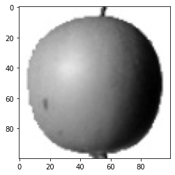
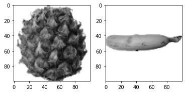
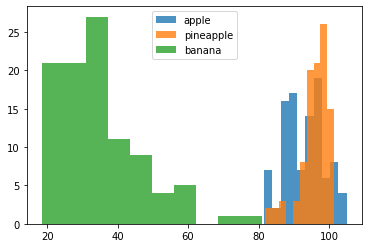
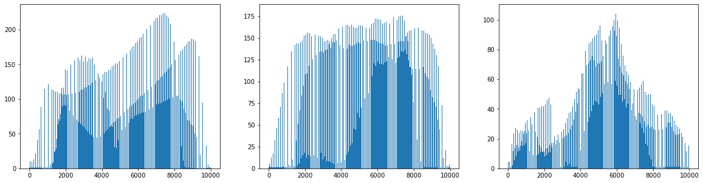
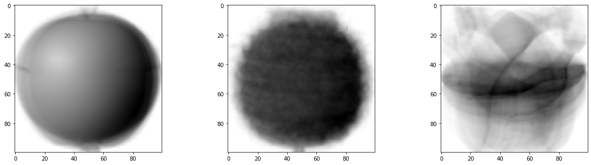
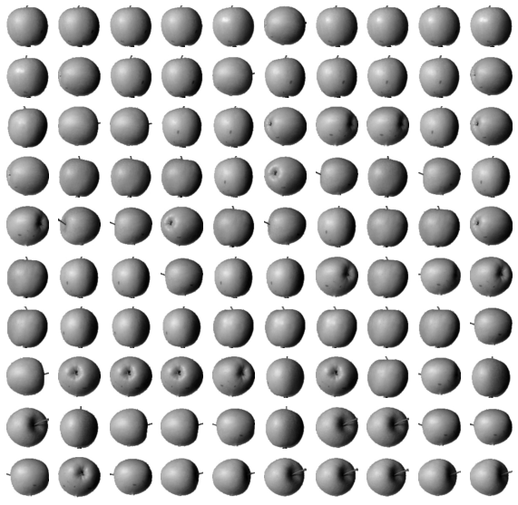
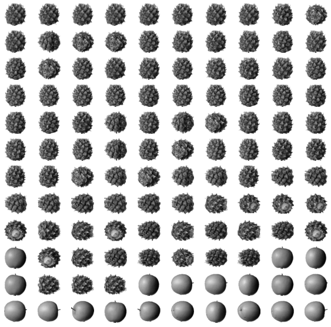
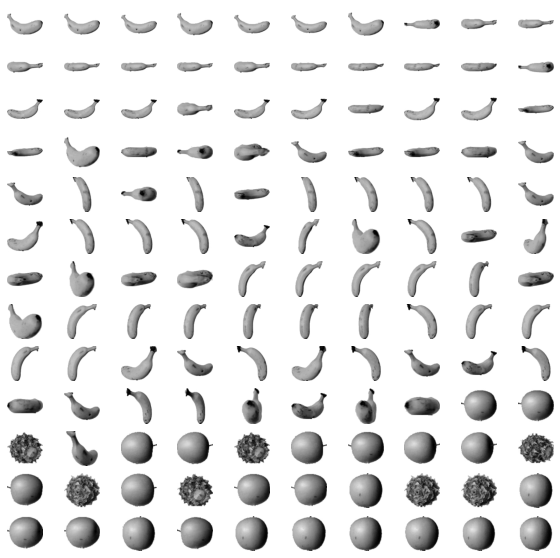

# 군집 알고리즘


## 1. 군집

 - 한 클러스터 안의 데이터 포인트끼리는 매우 비슷하고 다른 클러스터의 데이터 포인트와는 구분되도록 데이터를 나누는 것


 
​


## 2. 과일 사진 분류하기

### 과일데이터 준비하기

 - 사과, 바나나, 파인애플을 담고 있는 흑백사진 300장 분류
 - fruits는 넘파이 배열이며 100 * 100 사이즈의 샘플 300개를 갖고 있음


```python
import numpy as np
import matplotlib.pyplot as plt
```


```python
fruits = np.load("fruits_300.npy")
```


```python
fruits.shape
```

    (300, 100, 100)


 - matplotlib의 imshow 함수를 이용하여 넘파이 배열 이미지로 저장 가능


```python
plt.imshow(fruits[0],cmap="gray_r")
plt.show()
```


​    

​    


 - subplots 함수를 사용하면 여러 개의 그래프를 배열처럼 쌓을 수 있도록 도와줌
 - subplots(1,2) -> 1행 2열의 그래프 배열


```python
fig, axs = plt.subplots(1,2)
axs[0].imshow(fruits[100], cmap = "gray_r")
axs[1].imshow(fruits[200], cmap = "gray_r")
plt.show()
```


​    

​    


 - 100 * 100 2차원배열을 1 * 10000 1차원배열로 만듬 -> 배열 계산 용이
 - 사과사진 100개이므로 shape은 (100,10000) -> 10000픽셀 이미지 100개
 - reshape 함수 이용시 첫번째 차원 -1로 지정하면 자동으로 남은 차원 할당


### 픽셀값 분석하기

```python
apple = fruits[0:100].reshape(-1, 100*100)
```
```python
apple[79][6372]
```

    210


```python
apple.shape
```

    (100, 10000)

 - 픽셀의 샘플 구하기
 - 이미지 100개의 각 픽셀 10000개를 다 평균 내는 것
 - axis는 배열의 축을 의미
 - 2차원배열에서 axis = 1 일 경우 열 방향으로 계산 , axis = 0 일 경우 행 방향으로 계산


```python
print(apple.mean(axis=1))
```

    [ 88.3346  97.9249  87.3709  98.3703  92.8705  82.6439  94.4244  95.5999
      90.681   81.6226  87.0578  95.0745  93.8416  87.017   97.5078  87.2019
      88.9827 100.9158  92.7823 100.9184 104.9854  88.674   99.5643  97.2495
      94.1179  92.1935  95.1671  93.3322 102.8967  94.6695  90.5285  89.0744
      97.7641  97.2938 100.7564  90.5236 100.2542  85.8452  96.4615  97.1492
      90.711  102.3193  87.1629  89.8751  86.7327  86.3991  95.2865  89.1709
      96.8163  91.6604  96.1065  99.6829  94.9718  87.4812  89.2596  89.5268
      93.799   97.3983  87.151   97.825  103.22    94.4239  83.6657  83.5159
     102.8453  87.0379  91.2742 100.4848  93.8388  90.8568  97.4616  97.5022
      82.446   87.1789  96.9206  90.3135  90.565   97.6538  98.0919  93.6252
      87.3867  84.7073  89.1135  86.7646  88.7301  86.643   96.7323  97.2604
      81.9424  87.1687  97.2066  83.4712  95.9781  91.8096  98.4086 100.7823
     101.556  100.7027  91.6098  88.8976]


파인애플과 바나나도 같은 방식으로 픽셀 구하기


```python
pineapple = fruits[100:200].reshape(-1, 100*100)
banana = fruits[200:300].reshape(-1, 100*100)
```


```python
pineapple.mean(axis=1)
```

    array([ 99.3239,  87.1622,  97.193 ,  97.4689,  98.8892,  97.8819,
            95.1444,  92.9461,  95.8412,  96.9487,  93.2863, 101.2771,
            91.6511,  98.3901,  84.3277, 100.7017,  99.0229,  87.5298,
            99.4109,  91.8568,  90.3877,  99.5066,  95.8498,  96.0728,
           100.0062,  95.5283,  95.2715,  98.1624,  93.1395,  99.1666,
            99.9519,  96.732 ,  94.16  , 100.7644, 101.1263,  98.2852,
            98.5354, 101.3809,  95.4862,  93.1256,  87.6404,  93.7146,
            94.7279,  85.5131,  95.0937,  95.3236,  92.7696,  94.4375,
            99.36  ,  95.8924,  97.8221,  99.4014,  99.325 ,  95.025 ,
            97.5771,  97.3511,  99.4891,  97.366 , 101.0062,  91.2304,
            95.2824,  95.3544, 101.4657,  97.5239,  98.8419,  96.746 ,
            98.2922,  96.3969,  81.9464,  93.4927,  97.3872,  82.4883,
            95.3665,  95.2541, 101.3074,  97.2391,  95.4544, 100.5576,
           100.2927,  94.3088,  95.7401,  97.0982,  96.9559,  92.9114,
            97.4164, 100.769 ,  97.808 ,  99.2481, 101.0643,  94.8173,
            99.2639,  98.8539,  97.2198,  97.0201,  94.5039,  98.097 ,
            95.0201,  98.8078,  99.4634, 100.0257])


```python
banana.mean(axis=1)
```

    array([19.5487, 24.4884, 36.7517, 18.568 , 53.572 , 31.5789, 51.9062,
           28.4703, 23.7856, 32.1295, 29.1737, 24.5578, 27.7676, 41.3082,
           61.0437, 32.6444, 38.4187, 30.4175, 30.0639, 21.4994, 32.6018,
           39.6335, 47.8397, 57.7484, 33.6511, 23.5018, 49.6817, 44.0855,
           46.1559, 33.4963, 36.0099, 69.0751, 33.9575, 32.8786, 60.1911,
           32.9949, 45.3359, 56.1694, 36.9218, 25.6754, 32.7901, 29.0245,
           57.7134, 44.6563, 31.2138, 29.836 , 40.9228, 23.7501, 43.1543,
           32.3716, 26.0986, 55.6189, 22.2269, 29.5089, 24.0435, 22.6247,
           24.1709, 46.2714, 32.0763, 42.5076, 44.5522, 24.0199, 27.68  ,
           32.4377, 19.2198, 22.5083, 19.6742, 26.1852, 25.8368, 25.2676,
           26.4721, 34.8503, 28.5235, 80.8545, 36.9371, 47.3975, 18.7909,
           33.0428, 37.8222, 34.7819, 33.6051, 24.3963, 32.7988, 19.7609,
           32.538 , 28.5407, 23.0999, 26.3778, 27.1965, 38.7848, 18.7648,
           30.2297, 54.3816, 37.9073, 32.3126, 31.0664, 33.1657, 37.6051,
           38.1806, 26.2805])


### 히스토그램 구하기

 - 히스토그램 : 값이 발생한 빈도를 그래프로 표시한 것
 - matplotlib의 hist함수를 사용하여 그릴 수 있음
 - alpha 매개변수 1보다 작게하면 투명도 줄 수 있다
 - legend 함수를 이용하여 어떤 과일의 히스토그램인지 범례를 만들 수 있음


```python
plt.hist(np.mean(apple, axis=1),alpha=0.8)
plt.hist(np.mean(pineapple, axis=1),alpha=0.8)
plt.hist(np.mean(banana, axis=1),alpha=0.8)
plt.legend(['apple','pineapple','banana'])
plt.show()
```


​    

​    


- 사과와 파인애플은 구분하기 힘들다

### 해결책

 - 전체 샘플에 대해 각 픽셀의 평균값 계산하기
 - 세 과일은 모양이 다르므로 픽셀값이 높은 위치가 조금 다를 듯
 - axis = 0으로 해놓으면 됨


```python
fig, axs = plt.subplots(1,3,figsize=(20,5))
axs[0].bar(range(10000),np.mean(apple, axis=0))
axs[1].bar(range(10000),np.mean(pineapple, axis=0))
axs[2].bar(range(10000),np.mean(banana, axis=0))
plt.show()
```


​    

​    


각 픽셀을 평균 낸 이미지 = 모든 사진을 합쳐 놓은 대표 이미지


```python
apple_mean = np.mean(apple, axis=0).reshape(100,100)
pineapple_mean = np.mean(pineapple, axis=0).reshape(100,100)
banana_mean = np.mean(banana, axis=0).reshape(100,100)

fig, axs = plt.subplots(1,3,figsize=(20,5))

axs[0].imshow(apple_mean, cmap="gray_r")
axs[1].imshow(pineapple_mean, cmap="gray_r")
axs[2].imshow(banana_mean, cmap="gray_r")

plt.show()
```


​    

​    


### 평균값과 가까운 사진 고르기

 - abs_diff -> 전체 과일 각 픽셀 - 사과의 각 픽셀 평균 (300,100,100)
 - abs_mean -> 각 과일의 전체 픽셀 오차(abs_diff[num]) 평균


```python
abs_diff = np.abs(fruits-apple_mean)
abs_mean = np.mean(abs_diff, axis=(1,2))
print(abs_mean.shape)
```

    (300,)


 - argsort : abs_mean 배열을 오름차순으로 정렬한 후 각 value의 index 반환
 - 이 중 처음 100개 추출하여 10 * 10 격자 그래프 그리기


```python
apple_index = np.argsort(abs_mean)[:100]
print(apple_index)
```

    [33 48 70 57 87 12 78 59  1 74 86 38 50 92 69 27 68 30 66 24 76 98 15 84
     47 90  3 94 53 23 14 71 32  7 73 36 55 77 21 10 17 39 99 95 11 35 65  6
     61 22 56 89  2 13 80  0 97  4 58 34 40 43 75 82 54 16 31 49 93 37 63 64
     41 28 67 25 96  8 83 46 19 79 72  5 85 29 20 60 81  9 45 51 88 62 91 26
     52 18 44 42]


```python
fig, axs = plt.subplots(10,10,figsize=(10,10))
for i in range(10):
    for j in range(10):
        axs[i,j].imshow(fruits[apple_index[i*10 + j]],cmap="gray_r")
        axs[i,j].axis('off')
plt.show()
```


​    

​    


```python
abs_diff_pa = np.abs(fruits-pineapple_mean)
abs_mean_pa = np.mean(abs_diff_pa, axis=(1,2))
pineapple_index = np.argsort(abs_mean_pa)[:120]
fig, axs = plt.subplots(12,10,figsize=(10,10))
for i in range(12):
    for j in range(10):
        axs[i,j].imshow(fruits[pineapple_index[i*10+j]],cmap="gray_r")
        axs[i,j].axis('off')
plt.show()
```


​    

​    


```python
abs_diff_b = np.abs(fruits-banana_mean)
abs_mean_b = np.mean(abs_diff_b, axis=(1,2))
banana_index = np.argsort(abs_mean_b)[:130]
fig, axs = plt.subplots(13,10,figsize=(10,10))
for i in range(13):
    for j in range(10):
        axs[i,j].imshow(fruits[banana_index[i*10+j]],cmap="gray_r")
        axs[i,j].axis('off')
plt.show()
```


​    

​    


## 3. 비지도학습

 - 정답 라벨이 없는 데이터를 비슷한 특징끼리 군집화 하여 새로운 데이터에 대한 결과를 예측하는 방법
